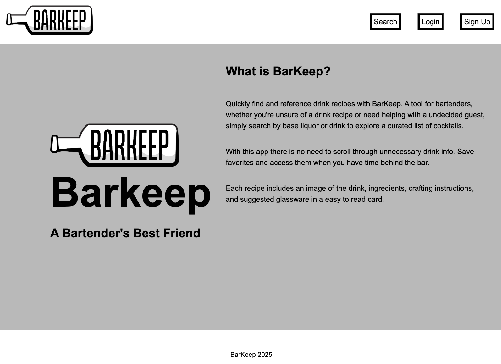

## BarKeep



A bartender-friendly cocktail lookup and bookmarking app built with Next.js and React. Search by drink name or base liquor, explore detailed recipes, and save your favorites for quick access behind the bar.

 Live Link: 

---

## Features


- **Search Cocktails**  
  Find any cocktail by name or choose a liquor base (vodka, rum, tequila, etc.) to discover matching recipes.


- **Cocktail Details**  
  View an image of what the drink should look like, ingredient lists, measurements, crafting instructions, and recommended glassware.

- **Save Your Favorites**  
  Save and remove favorite cocktails by signing up (not required). Favorites persist in your session (via Iron Session) so you can revisit them later.

- **Responsive Design**  
  Works seamlessly on desktop, tablet, and mobile screens.

---

- **API:** [TheCocktailDB](https://www.thecocktaildb.com/)  For educational use!

---


This is a [Next.js](https://nextjs.org/) project bootstrapped with [`create-next-app`](https://github.com/vercel/next.js/tree/canary/packages/create-next-app).

## Getting Started

First, run the development server:

```bash
npm run dev
# or
yarn dev
```

Open [http://localhost:3000](http://localhost:3000) with your browser to see the result.

You can start editing the page by modifying `pages/index.js`. The page auto-updates as you edit the file.

[API routes](https://nextjs.org/docs/api-routes/introduction) can be accessed on [http://localhost:3000/api/hello](http://localhost:3000/api/hello). This endpoint can be edited in `pages/api/hello.js`.

The `pages/api` directory is mapped to `/api/*`. Files in this directory are treated as [API routes](https://nextjs.org/docs/api-routes/introduction) instead of React pages.

## Learn More

To learn more about Next.js, take a look at the following resources:

- [Next.js Documentation](https://nextjs.org/docs) - learn about Next.js features and API.
- [Learn Next.js](https://nextjs.org/learn) - an interactive Next.js tutorial.

You can check out [the Next.js GitHub repository](https://github.com/vercel/next.js/) - your feedback and contributions are welcome!

## Deploy on Vercel

The easiest way to deploy your Next.js app is to use the [Vercel Platform](https://vercel.com/new?utm_medium=default-template&filter=next.js&utm_source=create-next-app&utm_campaign=create-next-app-readme) from the creators of Next.js.

Check out our [Next.js deployment documentation](https://nextjs.org/docs/deployment) for more details.


